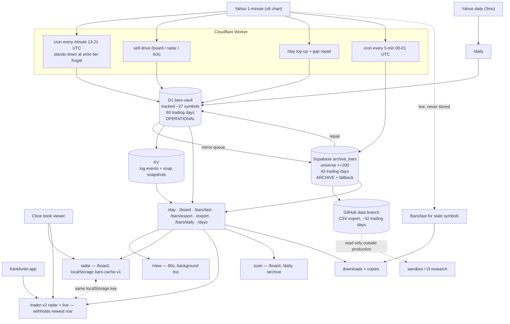

# ARCHITECTURE — CURRENT STATE, 50 QUESTIONS

Answers are CODE-DERIVED from this repo (worker.js, the pages, engine files)
unless marked MEASURED, LOCALLY VERIFIED, NOT VERIFIED or UNKNOWN.
No proposals, no target state. Line numbers are from commit at the time of
writing; endpoint records with resolved lines are in UI_ACTION_DATA_LINEAGE.md.

---

## 1. Is there a single source of truth for a candle?
**No. There is no single source of truth today.**
For `symbol + date + time` the answer depends on which endpoint is asked:
- D1 `bars` is the **operational** store: every ingestion path writes there first,
  it holds only **tracked** symbols (~27) and only the last **60 trading days**.
- Supabase `archive_bars` holds the **universe** (up to 200 symbols) for **42
  trading days**, and is written both as a mirror of D1 and directly from Yahoo.
- For a tracked symbol and a recent date, both stores hold the same minute, and
  which one answers depends on the endpoint (Q4, Q5).

## 2. Why do D1, Supabase and GitHub exist in parallel?
| Store | Role in code | Written by | Read by |
|---|---|---|---|
| D1 `bars` | operational store for tracked symbols, 60 trading days | cron sync, /day top-up, self-drive, gap repair, /watch/add | every page endpoint |
| Supabase `archive_bars` | archive for the 200-symbol universe, 42 trading days; also a read fallback | mirror after each sync, nightly Yahoo pass, /universe/add, /archive/fill | /day (past dates), /board (symbols missing in D1), /bars/export (union), /export (when D1 empty), /days, /archive/*, publish |
| GitHub `data` branch | export of the archive as CSV | nightly publish, /publish/shard, /archive/run | **nothing in production**; only the sandbox / t3 research |
| KV | event log + frozen-tier snapshot cache | logEvent, snapshotPut | /log, and **market data** at frozen tier (Q13) |

**Unnecessary overlap: yes.** Supabase duplicates 42 of D1's 60 days for every
tracked symbol, and both are read by different endpoints with different rules.

## 3. Can a candle be created by more than one path?
Yes. Nine writing paths:
1. cron `syncSymbol` (Yahoo 1d) → D1
2. self-drive `syncMany` (Yahoo 1d) → D1
3. `/day` stale top-up (Yahoo 1d) → D1
4. `repairSessionGaps` → Supabase first, then Yahoo 5d → D1
5. `/watch/add` (Yahoo 1d) → D1
6. mirror queue (D1 rows) → Supabase
7. nightly shard (Yahoo 5d) → Supabase
8. `/universe/add` (Yahoo 5d) → Supabase
9. `/archive/fill` (Yahoo 5d) → Supabase
**Who wins:** inside D1, the UPSERT overwrites when any value differs and bumps
`revisions` — plain last-write-wins, with no comparison of data vintage. Inside
Supabase, upsert on `(symbol_id, unix)`, also last-write-wins. Across stores
nothing reconciles them; precedence is decided per endpoint at read time.

## 4. If D1 and Supabase disagree on the same minute, who wins — per endpoint?
| Endpoint | Winner |
|---|---|
| `/day` (full or since) | D1. Supabase is read **only** when D1 returned 0 rows for a past date |
| `/board` | D1 per symbol. A symbol with 0 D1 rows for that date is served wholly from Supabase |
| `/bars/export` | **D1** — both stores are read for the whole range, merged on `date:unix`, first-wins, D1 inserted first |
| `/export` | D1. Supabase only when D1 returned 0 rows |
| `/bars/last` | D1, unless the symbol is "behind", and then a **live Yahoo** copy replaces the whole symbol |
| `/bars/daily`, `/bars/count` | D1 only; Supabase never consulted |
| `/days` | D1 dates win; Supabase adds only dates D1 lacks |
| `/archive/check`, `/archive/dates` | Supabase only |
| publish → GitHub | Supabase only; D1 never consulted |

## 5. Endpoint → source table
| Endpoint | D1 | Supabase | Yahoo | KV | Merge? |
|---|---|---|---|---|---|
| `/day` | yes | only if D1 empty (past date) | top-up + repair (writes) | snapshot at frugal/frozen | no |
| `/board` | yes | per missing symbol (≤13) | self-drive (writes) | snapshot at frozen | per symbol |
| `/bars/last` | yes | no | live for stale symbols | no | per symbol |
| `/bars/export` | yes | yes | no | no | **yes, per minute** |
| `/export` | yes | only if D1 empty | no | no | no |
| `/bars/daily` | yes | no | no | no | minute aggregate + daily_bars |
| `/bars/count`, `/bars/index`, `/days`, `/coverage` | yes | counts / symbol list | no | no | per symbol |
| `/daily` | daily_bars | no | daily refresh (writes) | no | no |
| `/archive/*` | cursor/meta | yes | fill/run (writes) | events | no |
| `/book` | no | no | **Cboe** | no | no |
| `/table` | raw, unfiltered | no | no | no | no |
| `/log` | no | no | no | yes | no |

## 6. Why do `/export` and `/bars/export` differ?
`/export` reads D1 and falls back to Supabase **only when D1 returned nothing**;
`/bars/export` reads both and unions them. Both are current code; the comments
give no reason. **Assessment (not proven): legacy** — `/export` returns the raw
D1 row shape including `unix`, `revisions`, `first_seen`, `updated_at`, which is
the older debug-style export, while `/bars/export` returns the clean 8-column CSV.
**Other pairs that look the same to a user but read differently:**
- scan "העתק את כל הימים" and data-page "הורד קובץ" (`/export`) vs `/bars` "הורד כל ההיסטוריה" (`/bars/export`)
- radar "טווח תאריכים…" (per-day `/day`) vs `/bars` range download (`/bars/export`)
- `/bars` "N אחרונים" (`/bars/last`, may be live Yahoo) vs radar menu "N נרות אחרונים" (browser memory)
- `/data` view "bars" (`/day`, canonical-filtered) vs `/data` view "table bars" (`/table`, raw rows)
- bulk download at minute resolution (D1+Supabase) vs daily resolution (`/bars/daily`, D1 only)

## 7. A week of candles — exactly what happens
Through `/bars/export?from&to`: D1 is queried for the **whole range**; Supabase is
queried for the **whole range** (UTC day bounds, pages of 1000, cap 60000); results
are merged on `date:unix` with D1 first-wins; sorted by unix; returned as CSV.
No per-day split, no Yahoo, no GitHub, no KV. Missing minutes are **not** filled.
Silent fallback: yes — a Supabase failure is caught and the response contains D1
rows only, with no flag. Through the radar range copy it is one `/day` per date
instead, i.e. per-day source selection with no union inside a day.

## 8. Only the last two candles
`/bars/last?n=2`: per symbol, D1 `… WHERE symbol=? AND unix < <current minute> AND <canonical> ORDER BY unix DESC LIMIT 2`.
If the symbol is "behind" (not held; or market open and newest bar older than 120 s;
or market closed and today does not reach 15:59) the Worker fetches **Yahoo 5d live**
and returns that instead, without storing it (≤40 symbols per request).
**Difference from a day/week request:** it is the only read path that can return
minutes that are not in any store, it crosses date boundaries by unix ordering,
and it never consults Supabase.

## 9. Can UI, Trader, Radar, Scanner, Download and Copy hold different datasets in the same second?
Yes. Every cause found in code:
1. different stores per endpoint (Q4/Q5)
2. `/bars/last` live Yahoo copies that are never stored
3. KV snapshots served at frozen tier (up to 15 minutes old)
4. `localStorage` restore at radar page load, including rows written by the other radar
5. browser memory: copies take what the tab holds, aged by the refresh interval (3–120 s)
6. different poll cadences: view 60 s, radar `#every`, live 15 s, scan 5 min
7. Trader pages withhold the newest row; other screens show it
8. pre-v249 rows still stored: duplicate minutes and 16:00 rows, hidden by canonical-filtered endpoints but still returned raw by `/table`
9. gap repair changing D1 between two reads
10. per-symbol source choice in `/board`: some symbols D1, others Supabase

## 10. Which actions display/copy from browser memory instead of re-reading the canonical source?
From the lineage document: V-06 (view copy), B-04, B-05 (day CSV copy/download),
B-15 (daily copy/download), R-08/T-08 (full analysis pack), R-09/T-09 (short state),
R-10/T-10 (all candle-menu options), R-13/T-13, R-14/T-14 (buy card), T-18, T-19,
T-20 (validation downloads/copy), L-03 (decision log), D-02 (grid CSV copy),
TR-02/TR-05 (replay). **16 of the 18 copy/download actions in the app.**

## 11. localStorage — exactly what is stored
| Key | Written by | Content | Read by | Lifetime | Staleness check |
|---|---|---|---|---|---|
| `bars-cache-v1` | both radars, after every `loadAll` | `{date, saved, bySym:{SYM:[rows]}}` | both radars, at page load | until overwritten or the browser clears it | **none**: `saved` is written but never compared; only `date` is used, and the first `/board` uses the cached newest unix as cursor |
| `scan:<date>` (scan's `cacheKey`) | scan, for prior days | rows of that day | scan `loadPriorDays` | until overwritten | none — the day is historical |
Quota failures are swallowed (`catch`), so a cache write can silently not happen.

## 12. Why do the two radars share `bars-cache-v1`?
Not by design; both files declare the same constant. The schema is identical
(rows as returned by `/board`), so a load does not crash. **Yes, one radar can
restore state the other wrote** — including a different symbol set and a
different date — and treats it as its own, seeding `lastBoardUnix` from it.

## 13. What does KV do besides logging?
Two key families: `log:<UTC date>` (events) and `snap:<SYM|BOARD>:<ET date>`.
**Yes, KV serves market data:** `/board` returns `snap:BOARD:<date>` when the read
tier is frozen; `/day` returns `snap:<SYM>:<date>` when the read tier is frozen, and
also at frugal for today's full read when a snapshot is held. Snapshots are written
at most every 15 minutes per isolate and expire after 3 days.

## 14. NORMAL → WARN → FRUGAL → FROZEN
Thresholds (`TIER_WARN 0.55`, `TIER_FRUGAL 0.75`, `TIER_FROZEN 0.90`) are applied
separately to reads (`read_tier`) and writes (`write_tier`).
| Tier | Writes | Reads | What is returned instead |
|---|---|---|---|
| normal (<55%) | all paths write | all reads | — |
| warn (≥55%) | unchanged | unchanged | every request also logs `budget_warn` to KV; radars show the badge |
| frugal (≥75%) | **cron stands down entirely** (`cron_skipped`); `/day` top-up blocked (`writesTight`); `/daily` refresh blocked | `/day` full read of today prefers a KV snapshot if held | snapshot or fewer fresh bars |
| frozen (≥90%) | cron stands down; self-drive disabled | `/board` and `/day` refuse D1 | KV snapshot, else `frozen:true` / 503 |
Radar pages force the refresh interval to 120 s at frugal and to off at frozen.

## 15. Can quota keep closed candles out of D1?
Yes. At write tier frugal the cron stops writing. Self-drive still runs while
the read tier is below frozen and can fill in, but only when a `/board`, `/radar`
or `/tick` request arrives and the gap conditions hold.
**How long can a candle stay only at Yahoo:** until any sync covers that minute.
The incremental window is 15 minutes, so a stand-down longer than that leaves a
hole for `repairSessionGaps`, which runs on the next **full** `/day` read of that
symbol-day. Nothing guarantees such a read happens. Yahoo keeps ~7 days of
1-minute history, so after that the minute is unrecoverable. **NOT VERIFIED in
production:** how often this actually occurred.

## 16. Who repairs gaps, and why can a GET write?
- `repairSessionGaps` — inside `/day` on every **full** read with more than one row.
- `repairFromOpen` in both radars — picks ≤8 symbols whose first row is after
  09:35 and calls that same `/day`.
- `/archive/fill`, `/archive/run` — Supabase only.
GET writes because repair and top-up are attached to the read path: the code
treats "someone is looking at this day" as the trigger to complete it. There is
**no cooldown**, so an unfillable hole re-triggers a Supabase read plus a Yahoo
5d fetch on every full read.

## 17. GET endpoints with side effects
| Endpoint | Side effect |
|---|---|
| any request | `ensureSchema` (first per isolate, DDL); usage/usage_route upsert (≤1/min per isolate) |
| `/day` | Yahoo top-up + D1 UPSERT; gap repair (Supabase→D1, Yahoo→D1); KV snapshot put |
| `/board` | self-drive (Yahoo + D1 writes); KV snapshot put; `board_full_read` log |
| `/radar`, `/tick` | self-drive |
| `/daily` | Yahoo daily fetch + `daily_bars` writes; `fetched_at` update |
| `/audit` | writes `meta` (audit_result, audit_at) |
| `/watch/add`, `/watch/remove` | D1 `symbols` writes + KV log |
| `/universe/add` | D1 `universe_extra` + Supabase writes |
| `/archive/fill`, `/archive/run` | Supabase writes, GitHub commits, KV events |
| `/publish/shard`, `/publish/state` | GitHub commits |
| `/archive?apply=1` | **DELETE** from D1 bars/days |
| `/logtest` | KV write |

## 18. Lifecycle of AAPL 2026-09-21 15:38
| Stage | When | Where | What can change |
|---|---|---|---|
| exists | 15:38:00–15:38:59 ET | Yahoo only | — |
| ingestion | next cron run after 15:39:00 (or self-drive / `/day` top-up) | `fetchYahoo`: drops the forming minute, rounds to 4 dp, null prices → flat bar at previous close volume 0, rejects non-minute and out-of-session stamps (v250) | a null-price minute becomes an invented flat bar |
| normalize | same call | `localDateTime` → ET date `2026-09-21`, time `15:38`, `unix` 1790019480 | — |
| store | same call | D1 `bars` UPSERT; `days` recount; `symbols` update | later syncs may overwrite values and bump `revisions` |
| archive | seconds later | mirror queue → Supabase `archive_bars` | nightly Yahoo pass can overwrite it with a later Yahoo version |
| publish | that night | Supabase → GitHub CSV | currently failing (MEASURED: `publish_failed`) |
| UI | next poll | `/board` or `/day` → browser store | can be replaced by a re-read (V2) or skipped (production radar) |
| Trader | next evaluation | V2 engine over closed rows | the **newest** row is withheld, so 15:38 is used only once 15:39 is stored |

## 19. Is Supabase a real archive?
It is a real archive with real deletion. `archivePrune` runs on the nightly
wrap-around: `DELETE FROM archive_bars WHERE unix < now − ARCHIVE_DAYS*86400*(7/5)`
with `Prefer: count=exact`. `ARCHIVE_DAYS = 42` is therefore **retention that
deletes data**, not just a working window.

## 20. Where are 90-day-old candles?
**Lost**, for everything the app reads: D1 prunes beyond 60 trading days,
Supabase deletes beyond ~42 trading days, and the GitHub CSV is rewritten each
publish from Supabase with a ~46-calendar-day window.
The only place older bytes could survive is the **git history** of the `data`
branch (old commits of `data/bars/<SYM>.csv`). Nothing in the app reads it, and
whether that history goes back 90 days is NOT VERIFIED.

## 21. What is the GitHub CSV for?
Export. Publishing writes `data/bars/<SYM>.csv` plus `data/state/*.json`.
**Nothing in production reads it** — the Worker never fetches GitHub. It is read
by the sandbox and by t3 research. As a restore path it is untested: no code
imports CSVs back into D1 or Supabase.

## 22. Why is the CSV built from Supabase, and can it differ from D1?
`publishShard` calls `archiveRead` (Supabase) for each universe symbol. It is
built there because the universe (200 symbols) exists only in Supabase, while D1
holds only tracked symbols. **Yes, it can differ from D1**: the nightly pass
writes Supabase from a fresh Yahoo 5d pull, which can revise a minute that D1
still holds in its older form, and nothing reconciles the two.

## 23. How many times is the same candle written?
| Path | Writes |
|---|---|
| D1 insert | 1 |
| D1 revisions | 0..n — every later sync that sees a different value (cron runs every minute with a 15-minute overlap window, so a minute is re-examined ~15 times, and written only when a value changed) |
| Supabase mirror | 1 per D1 change |
| nightly Yahoo → Supabase | 1 per nightly pass that covers it (5-day window ⇒ up to ~5) |
| `/universe/add`, `/archive/fill` | 1 per manual run |
| GitHub publish | the whole symbol file is rewritten per publish (nightly), so the candle is re-published ~32 times before it leaves the window |
Typical tracked candle: 1 D1 insert, 0–2 D1 updates, 1–3 Supabase writes, ~32 CSV rewrites.

## 24. How many times is it read in a typical day?
Per minute of the session: the cron re-reads the whole symbol-day once per
symbol (`DAYS_REFRESH`), each open radar tab reads it again through `/board`
(the V2 radar re-reads the last 15 minutes each pass and the whole day every
10th), each `/view` tab re-reads its whole day every 60 s, and `trader-v2-live`
re-reads the whole day every 15 s. **Redundant re-reads:** `DAYS_REFRESH` (the
same rows re-counted every minute), the V2 full pass every 10 minutes, `/view`
full re-reads, `trader-v2-live` full re-reads, and repair re-reads with no cooldown.

## 25. Queries that re-read hundreds of candles only to update or produce metadata
1. `DAYS_REFRESH` — COUNT/SUM/MIN/MAX over the whole symbol-day, every sync (~85% of cron reads)
2. `/bars/daily` — two passes over all minute rows in range (aggregate + first/last)
3. `/audit` — sampled rows per symbol-day plus `days` rows
4. `/storage` — `COUNT(*) … COUNT(DISTINCT date)` over the entire `bars` table
5. `ensureSchema` days backfill — full scan, once per database
6. `/days` — reads the symbol's entire Supabase history just to count per date
7. `/archive/check`, `/archive/dates` — whole Supabase histories to count days
8. `/bars/count` — `days` rows only (cheap), but called for every bulk estimate

## 26. UI actions that read a full day where a delta would do
`/view` load and its 60 s refresh (4 full `/day` reads each time);
`trader-v2-live` every 15 s; the V2 radar full board pass every 10th refresh;
V2 `loadSymbol` for symbols with holes; `repairFromOpen` (≤8 symbols);
radar card open / date change; `/bars` day chip; `/data` bars view.

## 27. Polling loops that keep running in a background tab
| Loop | Interval | Reads | Hidden check |
|---|---|---|---|
| `/view` refresh | 60 s | 4 × full `/day` | **none** |
| `trader-v2-live` tick | 15 s | full `/day` + `/board` | **none** |
| radar `/tick` (both radars) | 60 s | heartbeat, triggers self-drive | **none** |
| radar board refresh | `#every` (default 60 s) | `/board` | yes, paused |
| scan loadAll / live interest | 5 min / 60 s | `/board`, `/daily` | yes, paused |

## 28. Backend requests from one radar tab per minute
Per refresh: 1 `/` + 1 `/day?since` per market symbol (SPY, QQQ + up to 4 sector
ETFs = 2–6) + 1 `/board` + `/usage` + `/book` when a card is open + up to 8
`/day` full reads when `repairFromOpen` has work + (V2) up to 12 `/day` for
symbols with holes. Plus 1 `/tick` per minute.
| Refresh | Requests/minute (no card open, nothing to repair) |
|---|---|
| 60 s | ~5–9 |
| 10 s | ~25–50 |
| 3 s | ~80–160 |

## 29. D1 rows_read from one tab per day (CODE-DERIVED model, `docs/audit/d1_cost_model.mjs`)
For a 27-symbol board, one session:
| Source | Rows |
|---|---|
| V2 radar tab, v248 overlap + full every 10th | ~350,000 |
| V2 radar tab, pre-v248 (full read every minute) | ~2,059,000 |
| `/view` tab (4 full days per minute) | ~230,000 |
| `trader-v2-live` (one symbol, 15 s) | ~306,000 |
| production radar incremental | ~21,000 |
| `/tick` | ~11,000 |
| cron (not a tab, for scale) | ~2,417,000, of which ~85% is `DAYS_REFRESH` |
Per-request additions: 1 usage row per request; `/usage` ≤21 rows per refresh.

## 30. KV operations from one tab per day
Reads: 1 `log:` get per event the tab causes. Writes: `board_full_read` on every
full `/board` (1 get + up to 1 put), `budget_warn` on **every request** once the
tier is warn, `snapshotPut` at most once per 15 minutes per isolate for BOARD and
for each symbol-day. A single radar tab at 60 s with the tier at warn can
therefore reach ~60 gets + up to ~60 puts per hour; the 1,000/day write limit is
shared with the cron, which alone can emit ~1,080 (Q47).

## 31. What does the Trader actually need per refresh?
The V2 engine consumes the closed rows of today and derives everything from
them (`computeBars`: VWAP, EMA9/20, ATR, relVol running over the day so far).
It therefore needs the day **once**, plus new minutes after that. The V2 radar
does approximately this (15-minute overlap), but re-reads the whole day every
10th pass; `trader-v2-live` re-reads the **entire day every 15 seconds** and
uses only the last rows for a new decision. So no, it does not need a full day
every time, and it does not use most of the rows it re-reads.

## 32. Do Trader and Radar compute indicators from the same dataset?
No, on two counts:
- **Different engines:** the radar card uses `engine.cjs analyze`; Trader V2 uses
  `trader-v2-engine.cjs computeBars`. VWAP and EMA9/20 use the same formulas
  (cumulative typical×volume, k=2/10 and 2/21), verified by reading both.
- **Different inputs:** the Trader withholds the newest row; the radar's own
  analysis (`st.A`) includes it. Prior-day context differs too: the card loads
  ≤5 prior days, the Trader engine uses today only.

## 33. Can the same candle get different indicator values on two screens?
Yes. Relative volume has **four** definitions in the codebase:
1. `engine.cjs volx` — volume ÷ running average of the day so far
2. `trader-v2-engine.cjs relVol` — same definition, separate implementation
3. radar CSV copy `vol_x` — volume ÷ average of **that whole day** as loaded
4. server `/day` CSV `vol_x` — volume ÷ average over the day's rows returned
5. analysis pack section 15 — volume ÷ average of the **loaded window**
VWAP/EMA differ whenever the row set differs (newest row withheld, partial day,
duplicate rows before v249). ATR ("average candle range") is computed over the
last 20 loaded bars, so it too depends on the window.

## 34. What exactly is the Copy Card dataset?
Not one snapshot. It is a mixture built in the browser from:
today's rows (`/board`, last refresh), ≤5 prior days (`/day`, fetched when the
card was opened), the order book (`/book`, fetched on a later refresh), market
context (SPY/QQQ/sector `/day`, from the same `loadAll`), and values computed
locally. `buildTickerState` stamps one `calculated_at`, which makes it look
atomic; the inputs are not.

## 35. Can one card hold price 15:38, market context 15:36 and book 15:39?
Yes. The book is fetched on a refresh after the card opens, market ETFs are
fetched in the same `loadAll` as the board but as separate requests, and prior
days can be minutes older. **Freshness shown to the user:** the card's
FRESH/STALE badge and `stale_seconds` describe the **symbol's newest row only**.
Since v250 the V2 validation report also prints DATA_AS_OF, BAR_AGE, SOURCE and
MARKET_CONTEXT_AS_OF; the production radar card shows none of that.

## 36. Why is "Data source" hard-coded?
In `layers.cjs analysisPack` it is a literal string,
`'Data source: Yahoo Finance 1-minute bars via Cloudflare Worker'`. Nothing
passes provenance into the pack. **The real per-field sources are in
UI_ACTION_DATA_LINEAGE.md (R-08/T-08)**; rows can come from D1, Supabase, a KV
snapshot or localStorage, and the line does not distinguish them.

## 37. What does "Copy Candles" do today, per button?
| Button | Reads |
|---|---|
| radar card menu, all options (5/10/15/20/50, today, all loaded days, state+N) | browser memory only |
| radar card menu, "טווח תאריכים…" | `/day` per missing date, memory for dates already loaded |
| `/bars` "העתק CSV" (minute tab) | browser memory (rows from the day chip) |
| `/bars` "N אחרונים" | `/bars/last` — D1, or live Yahoo per symbol |
| scan "העתק" / "העתק את כל הימים" | `/export` — D1, else Supabase |
| `/data` "העתק CSV" | browser memory (grid rows) |
| view "העתק לצ׳אט" | browser memory |
So two buttons named "copy candles" answer from three different contracts.

## 38. Actions that can return silently partial data
1. `/bars/export` — Supabase failure caught, D1-only result
2. `/days` — Supabase failure caught, D1-only day list
3. `/board` — Supabase fallback failure leaves symbols in `not_fetched`; a
   symbol beyond the 13-symbol budget is simply absent
4. `/day` — archive fallback failure caught, empty rows
5. `/bars/daily` — `daily_bars` query failure caught, no provider rows (this is
   how the v250 regression hid)
6. `/archive/dates` — failing probes silently reduce the coverage basis
7. `/bars/last` — `live_failed` / `not_reached` symbols simply missing from rows
8. radar range copy — a day that fails to load is reported as a count only
9. `localStorage` write failures (quota) are swallowed
10. KV snapshot put failures are swallowed

## 39. Catches that hide a data-source failure
`archiveRead` callers in `/bars/export`, `/days`, `/board`, `/day`;
`daily_bars` query in `/bars/daily`; `/archive/dates` per-probe;
`fetchVenueBook` per venue; `mirrorBars` (logged as `mirror_failed`);
`snapshotPut`/`snapshotGet`; `flushUsage`/`flushRouteMeter`
(`accounting must never break a request`); `cacheSave` in the pages.

## 40. How does the system decide a day is COMPLETE?
`bars >= 380`, read from the **`days` metadata**, not from the candles
(worker.js `/bars/daily` and `/archive`). The metadata can be stale (it is
recomputed per sync today, and `/archive/check` counts Supabase rows instead).
380 accepts a day missing 10 minutes, and before v249 it also accepted a day
padded by duplicates. The stricter validator (`docs/audit/completeness.mjs`,
390 expected minutes, duplicates and out-of-session rows are failures) exists
only in the audit tooling; **production does not use it**.

## 41. Who uses the `days` table, and which columns?
| Consumer | Columns | Why |
|---|---|---|
| `/day` (no date given) | `MAX(date)` | pick the latest day to show |
| `/days` | date, bars, first, last, revisions | day list for `/bars`, radar card, replay |
| `/bars/count` | SUM(bars), COUNT(*) | download size estimate |
| `/bars/daily`… `/archive` | bars | "complete" flag (≥380) |
| `/audit` | bars, first, last | audit of the day |
| `/coverage`, `/storage`, `/selfcheck`, publishState | COUNT, SUM(bars), MIN/MAX(date) | coverage and status screens |
| `d1Prune` | DISTINCT date | which days to delete |
| `/archive?apply=1` | date, bars | compare against the archive before deleting |
| `/table/days` | all | raw viewer |

## 42. What information does `days` actually need to carry?
Per symbol-day: the number of canonical bars, the first and last minute label,
and the sum of revisions. All four are derivable from the bars themselves; the
table exists so that screens do not have to scan a day to show a count.

## 43. Which metadata must be real-time?
Used inside a live decision path: `symbols.last_bar_unix` and `last_fetch_at`
(self-drive staleness, `/day` top-up), and the `usage` row (tier gating).
Not real-time by any code path: `days.bars/first/last/revisions` (screens,
estimates, completeness flags), `meta.audit_result`, coverage tables.
The one live use of `days` is `MAX(date)` in `/day` when no date is given.

## 44. Writes that exist only for observability
`runs` insert per cron run; `usage` and `usage_route` upserts (≤1/min per
isolate); KV `log:` events; `meta.self_drive_at`; `meta.audit_result`/`audit_at`;
`meta` archive cursor.

## 45. Reads that exist only for UI decoration / coverage
`/coverage`, `/storage`, `/usage`, `/days` (Supabase counting half),
`/bars/count`, `/archive/check`, `/archive/dates`, `/audit`, `/selfcheck`, and
`DAYS_REFRESH` itself — none of them feed Trader correctness.

## 46. Ten most expensive operations by D1 rows_read (from the cost model)
1. `DAYS_REFRESH` across a session — ~2.06 M rows/day
2. `/storage` — full table scan (~1 M rows at 1 M stored)
3. `/board` full read × 27 symbols — up to ~10.5 K per call
4. `/bars/daily` over a wide range — two passes over every minute row
5. `/export` with no date — the symbol's whole D1 history
6. `/bars/export` wide range — the same, plus Supabase pages
7. `/day` full read — ~390 rows per call, ×4 per `/view` refresh
8. `ensureSchema` days backfill — full scan, once per database
9. `/audit` recompute — up to 25 symbols × sampled day
10. `/table/<name>?offset=` — offset rows are read and discarded

## 47. Ten biggest KV producers
1. `cron_fired` — one per cron run, 540/day
2. `cron_skipped_closed` — one per run outside the session
3. `cron_skipped` — one per run at write tier frugal
4. `board_full_read` — one per full `/board`, per tab
5. `budget_warn` — one per request once the tier is warn
6. `snapshotPut` BOARD — up to 1 per 15 min per isolate
7. `snapshotPut` per symbol-day — same, per symbol
8. `readLog` — 7 gets per `/db` page view
9. publish/archive events — `archive_pass`, `publish_shard`, `publish_failed`
10. `watch_add` / `watch_remove` / `self_drive` / `expensive_request` / `read_guard`
MEASURED (published log, 2026-09-20→21): 330 entries, 163 `cron_fired`,
150 `cron_skipped_closed`, zero folded repeats.

## 48. How much duplicate work comes from independent consumers?
Every tab reads the same board independently — there is no shared cache between
tabs (no BroadcastChannel, no SharedWorker). Two radars open on the same
symbols read the same rows twice, `/view` reads the same day again per symbol,
`trader-v2-live` reads a day that the radar already holds, the cron and
self-drive can sync the same minute twice within the same minute, and
`DAYS_REFRESH` re-reads rows the same sync just wrote.

## 49. Independent data paths between Yahoo and the user
Nine ingestion/serving paths: (1) cron → D1 → endpoint; (2) self-drive → D1 →
endpoint; (3) `/day` top-up → D1 → response; (4) gap repair Supabase→D1 and
Yahoo→D1 → response; (5) `/bars/last` live Yahoo → response, never stored;
(6) mirror D1 → Supabase → endpoint; (7) nightly Yahoo → Supabase → endpoint;
(8) Supabase → GitHub CSV → sandbox/t3; (9) KV snapshot → `/board` or `/day`.
Plus two non-Yahoo live paths to the user: Cboe (`/book`) and frankfurter.app
(FX in `trader-v2-live`).

## 50. Where consistency breaks — final list
1. two stores hold the same minute with no reconciliation (Q3, Q4)
2. per-endpoint precedence differs (Q5)
3. `/export` vs `/bars/export` return different history (Q6)
4. `/board` chooses a store **per symbol**, so one board mixes sources
5. `/bars/last` can return live Yahoo minutes that exist nowhere else
6. KV snapshots serve data up to 15 minutes old under the same endpoints
7. `localStorage` restores rows written by the other radar, with no staleness test
8. copies read browser memory aged by the refresh interval (16 of 18 copy actions)
9. Trader withholds the newest row; other screens show it
10. production radar never applies a server-side revision to a minute it has seen
11. the nightly Yahoo pass can revise Supabase without revising D1 — and the
    GitHub CSV is built from Supabase
12. four different relative-volume definitions, plus window-dependent VWAP/EMA/ATR
13. `/table` returns raw rows while every other endpoint applies the canonical filter
14. completeness is judged from possibly-stale metadata at `>= 380`
15. silent partial results whenever Supabase or a fallback fails (Q38)
16. rows stored before v249 (duplicate minutes, 16:00) still exist in D1,
    Supabase and the published CSVs, and are only hidden at read time

---

## CURRENT STATE diagram

