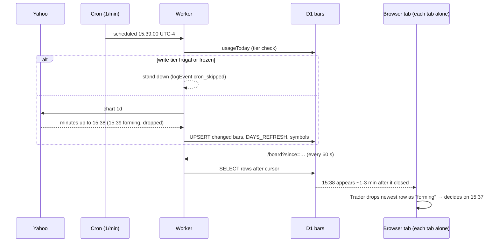

# DATA FLOW — one candle from provider to every consumer

Example: AAPL, 2026-09-21, the 15:38 minute. Every step is CODE-DERIVED from
the named function unless labelled otherwise.

## 1. Provider → Worker
| # | Source | Function | Transformation | Destination |
|---|---|---|---|---|
| 1 | Yahoo `v8/finance/chart/AAPL?interval=1m&range=1d|5d&includePrePost=false` | `fetchYahoo` (worker.js) | parallel arrays `timestamp[]`, `quote.open/high/low/close/volume[]` → `{unix,o,h,l,c,v}` | in-memory bars |
| 2 | 〃 | `fetchYahoo` | **forming minute dropped** (`ts + 60 > now`) — only minutes whose end has passed survive | 〃 |
| 3 | 〃 | `fetchYahoo` | prices rounded to 4 dp (`rnd(x,4)`); volume as given, null → 0 | 〃 |
| 4 | 〃 | `fetchYahoo` | a timestamp with **null prices** becomes a flat bar at the previous close, volume 0, `noTrade:true` (the flag is not stored) | 〃 |
| 5 | 〃 | `fetchYahoo` | **no check that `unix` is a minute start, no check it is inside 09:30–15:59** | 〃 |

Who calls `fetchYahoo`: `syncSymbol` (cron `1d`, self-drive `1d`, `/day` top-up `1d`, backfill `5d`), `repairSessionGaps` (`5d`), cron archive shard (`5d`), `/universe` pull (`5d`), `/bars/last` live top-up (`5d`, never stored).

## 2. Worker → D1 (the canonical store)
| # | Source | Function | Transformation | Destination |
|---|---|---|---|---|
| 6 | bars | `syncSymbol` | incremental: keep bars after `lastBarUnix − 15 min` (`OVERLAP_BARS`) | — |
| 7 | 〃 | `localDateTime(unix)` | UTC seconds → `date` `YYYY-MM-DD` and `time` `HH:MM` in **America/New_York** (minute START label) | — |
| 8 | 〃 | `UPSERT` | `INSERT … ON CONFLICT(symbol, unix) DO UPDATE` **only if a value changed**; `revisions+1`, `updated_at=now`, `first_seen` kept | `bars` |
| 9 | 〃 | bookkeeping batch | `DAYS_REFRESH` recount of the whole symbol-day; `symbols.last_bar_unix/last_fetch_at` | `days`, `symbols` |
| 10 | 〃 | `mirrorQueue` → `mirrorBars` (cron) / `archiveWrite` | same bars, key `(symbol_id, unix)` | Supabase `archive_bars` |

## 3. D1 → HTTP (every read path; LOCALLY VERIFIED in consistency_test.mjs)
| Route | Function | SQL filter | Output |
|---|---|---|---|
| `/day/:sym/:date?format=json` | `readDay`/`toCsvRows` | symbol, date [, unix>since] | JSON rows incl. `unix, first_seen, updated_at, revisions` |
| `/day/:sym/:date` | `toCsvRows` | same | CSV + derived cols (dir, body_pct, wicks, range, vol_x) |
| `/board?symbols=&date=&since=` | route `board` | symbol IN (≤60), date, unix>since | JSON rows `symbol,unix,date,time,OHLCV` |
| `/bars/last?symbols=&n=` | route `bars/last` | per symbol, latest n | JSON; stale symbols topped up LIVE from Yahoo, not stored, minute-aligned only |
| `/bars/export/:sym?from=&to=` | route `bars/export` | symbol, date range | CSV `symbol,date,time,OHLCV` |
| `/export/:sym[?date=]` | route `export` | symbol [, date] | CSV incl. unix, revisions, first_seen, updated_at |

## 4. HTTP → screens
| Screen | File | Endpoint | Cadence |
|---|---|---|---|
| Symbol card / chart | view.html `load()` | `/day/SYM/DATE` + `/day/SPY`, `/day/QQQ` | every 60 s while the day is live; **background tabs too** |
| Production radar | radar.html | `/board?since=` | `#every` (default 60 s), paused when hidden |
| V2 radar (Trader) | trader-v2-radar.html | `/board?since=` overlap 15 min, full every 10th; `/day` per symbol on open; `/tick` | 60 s; `/tick` also when hidden |
| Trader live | trader-v2-live.html | `/day/SYM/today` + `/board?symbols=SYM` | every 15 s while running |
| Scanner | scan.html | `/board`, `/daily/:sym`, `/archive/*` | on load / manual |
| Bars & copy | bars.html | `/bars/last`, `/bars/export`, `/coverage`, `/publish/*` | on click |

## 5. Outside the Worker
| Path | Function | Output |
|---|---|---|
| nightly publish (cron `*/5 0-1`) | `archiveNightlyShard` → GitHub | `data/bars/<SYM>.csv` `symbol,date,time,OHLCV` + `data/state/*.json` on the `data` branch |
| Trader 3 / sandbox research | `t3/` scripts | read the published CSV |

**There is no upload/import endpoint.** The Worker never reads a request
body (CODE-DERIVED: no `req.json/text/formData`). "Import" happens only
outside the Worker, from the published CSV.

## 6. Live vs historical (Phase 6)
- **Who polls the provider:** only the Worker — cron every minute
  13:00–21:59 UTC (`scheduledRun` → `syncMany`, `1d`), self-drive when the
  stalest tracked symbol is behind (`selfDriveIfStale`, triggered by
  `/board`, `/radar`, `/tick` requests), `/day` top-up for a stale symbol,
  `/bars/last` live top-up. Browsers never call Yahoo.
- **Browsers poll the Worker independently:** every tab runs its own timer;
  nothing is shared between tabs (no BroadcastChannel/SharedWorker —
  CODE-DERIVED by grep).
- **Current minute:** never stored and never served — dropped at ingestion.
- **Live → historical:** a minute is stored once its end has passed and the
  next sync runs; later syncs may revise it (`revisions+1`). It is the same
  row; there is no separate live table.
- **Which source wins:** last write wins on any value change. There is no
  vintage check, so an older provider payload arriving later would overwrite
  a newer one (INFERRED; no case observed).
- **Duplicates:** live and historical cannot duplicate each other (same key),
  but a **non-minute-aligned** provider timestamp creates a second row for the
  same minute (LOCALLY VERIFIED; MEASURED in the published archive).
- **Market open:** `marketOpen()` — any ET weekday with `09:30 <= HH:MM < 16:01`.
  **No holiday list and no half-days** (CODE-DERIVED): on a market holiday the
  cron syncs every minute and every symbol looks stale all day; on a half day
  the session is treated as open until 16:00. The 16:00 minute itself counts
  as open.

